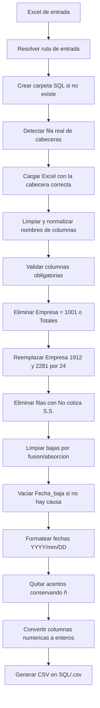

# LIMPIEZA_DATOS.py

## Descripción general

Este script procesa un fichero Excel de entrada con datos de personal y genera un fichero CSV limpio en una carpeta `SQL`.

El objetivo es:

- localizar automáticamente la fila real de cabeceras aunque el Excel tenga filas previas de título o resumen
- normalizar nombres de columnas para trabajar con cabeceras consistentes
- aplicar reglas de limpieza y filtrado sobre los datos
- formatear fechas y columnas numéricas para dejar la salida preparada para carga o consumo posterior

La salida se guarda en formato CSV con el mismo nombre base del fichero de entrada.

Ejemplo:

- entrada: `prueba3.xlsx`
- salida: `SQL/prueba3.csv`

## Diagrama rápido

```text
Excel de entrada
      |
      v
Detección automática de cabecera
      |
      v
Normalización de nombres de columnas
      |
      v
Filtros y reglas de negocio
      |
      v
Limpieza de textos y fechas
      |
      v
Conversión de columnas numéricas a enteros
      |
      v
CSV final en carpeta SQL
```

## Diagrama de flujo



## Requisitos

- Python 3
- `pandas`
- `openpyxl`
- `numpy`

## Uso

Ejecuta el script pasando como parámetro el fichero Excel que quieres procesar.

```bash
python LIMPIEZA_DATOS.py prueba3.xlsx
```

También puedes pasar una ruta completa:

```bash
python LIMPIEZA_DATOS.py /ruta/completa/archivo.xlsx
```

Si la ruta es relativa, el script la resuelve respecto a la carpeta en la que está guardado el propio script.

## Carpeta y nombre de salida

El script crea, si no existe, una carpeta llamada `SQL` dentro de la carpeta donde está el Excel de entrada.

Después genera el CSV de salida con esta regla:

- carpeta: `SQL`
- nombre: el mismo nombre base del Excel
- extensión: `.csv`

Ejemplo:

- entrada: `/Datos/prueba3.xlsx`
- salida: `/Datos/SQL/prueba3.csv`

## Qué hace el script paso a paso

### 1. Resuelve el archivo de entrada

La función `resolver_ruta_entrada()`:

- comprueba que se ha pasado un argumento por línea de comandos
- convierte la ruta a absoluta si hace falta
- valida que el fichero exista

Si no se pasa fichero, el script termina mostrando:

```text
Uso: python LIMPIEZA_DATOS.py <archivo_excel>
```

### 2. Construye la ruta de salida

La función `construir_ruta_salida()`:

- crea la carpeta `SQL` si no existe
- devuelve la ruta del CSV final

### 3. Detecta automáticamente la fila de cabeceras

Muchos Excel de origen no tienen las cabeceras en la primera fila porque incluyen:

- títulos
- resúmenes
- filas vacías
- textos auxiliares

La función `detectar_fila_cabecera()`:

- lee las primeras 10 filas del Excel sin asumir cabecera
- limpia provisionalmente los valores de cada fila
- busca una fila que contenga simultáneamente las columnas `Empresa` y `Nombre_empleado`

Cuando la encuentra, esa fila se usa como `header` real al cargar el Excel.

## Limpieza de cabeceras

Después de leer el Excel, el script normaliza todos los nombres de columna con `limpiar_cabecera()`.

Esta limpieza hace lo siguiente:

- elimina espacios al principio y al final
- elimina acentos, pero conserva `ñ` y `Ñ`
- sustituye separadores y símbolos por `_`
- elimina repeticiones de `_`
- elimina `_` al principio o al final

Ejemplos:

- `Empleado -  Código` -> `Empleado_Codigo`
- `Cotización seguridad soci` -> `Cotizacion_seguridad_soci`
- `Días percepción I.T.` -> `Dias_percepcion_I_T`

## Validación de columnas obligatorias

El script comprueba que existan estas columnas mínimas:

- `Empresa`
- `Cotizacion_seguridad_soci`
- `Causa_de_la_baja`
- `Fecha_baja`
- `Fecha_alta`
- `Fecha_nacimiento`
- `Fecha_antiguedad`

Si falta alguna, lanza un error con el detalle de las columnas detectadas.

## Reglas de transformación aplicadas

### Regla 1. Eliminar filas por empresa

Se eliminan las filas donde `Empresa` sea:

- `1001`
- `Totales`

Comparación aplicada tras convertir el valor a texto y eliminar espacios laterales.

### Regla 2. Sustitución de códigos de empresa

En la columna `Empresa`:

- `1912` se sustituye por `24`
- `2281` se sustituye por `24`

### Regla 3. Eliminar filas que no cotizan a la Seguridad Social

Se eliminan las filas donde:

- `Cotizacion_seguridad_soci == "No cotiza S.S."`

### Regla 4. Limpieza de bajas por fusión/absorción

Si `Causa_de_la_baja` contiene exactamente:

```text
Baja por fusión absorción empresa
```

entonces el script vacía:

- `Fecha_baja`
- `Causa_de_la_baja`

Internamente estos vacíos se guardan como nulos para evitar errores de tipos en `pandas`.

### Regla 5. Borrar fecha de baja si no hay causa

Si:

- `Fecha_baja` contiene una fecha válida
- y `Causa_de_la_baja` está vacía o nula

entonces se elimina el contenido de `Fecha_baja`.

### Regla 6. Formateo de fechas

Las columnas:

- `Fecha_alta`
- `Fecha_nacimiento`
- `Fecha_antiguedad`
- `Fecha_baja`

se convierten al formato:

```text
YYYY/mm/DD
```

Ejemplo:

- `2024/06/17`

Si el valor no es una fecha válida, queda vacío en la salida.

### Regla 7. Eliminación de acentos en todo el DataFrame

El script aplica `quitar_acentos()` a todas las celdas.

Comportamiento:

- elimina tildes y diéresis
- conserva `ñ` y `Ñ`
- no rompe valores nulos
- no altera números ni otros tipos no texto

Ejemplos:

- `TÉCNICOS` -> `TECNICOS`
- `Categoría` -> `Categoria`
- `niñez` -> `niñez`

### Regla 8. Conversión de columnas numéricas a enteros sin decimales

Estas columnas se fuerzan a formato entero sin decimales:

- `Empleado_Codigo`
- `Dias_alta_en_la_empresa_p`
- `Tarifa`
- `Codigo_categoria`
- `Codigo_contrato`
- `Dias_percepcion_I_T`
- `Dias_accidente`

Regla aplicada:

- si el valor es numérico, se convierte a entero y después a texto sin `.0`
- si el valor no existe, queda vacío

Ejemplos:

- `4.0` -> `4`
- `30.0` -> `30`
- vacío -> vacío

## Formato final del CSV

El fichero se guarda con:

- separador CSV por defecto de `pandas`
- `encoding="utf-8-sig"`
- sin índice

Eso permite abrirlo con Excel conservando bien caracteres especiales en la mayoría de casos.

## Ejemplo de flujo completo

```bash
python LIMPIEZA_DATOS.py prueba3.xlsx
```

Resultado esperado:

```text
OK: archivo generado en /ruta/de/la/carpeta/SQL/prueba3.csv
```

## Errores controlados habituales

### No se pasa fichero de entrada

Error:

```text
Uso: python LIMPIEZA_DATOS.py <archivo_excel>
```

### El fichero no existe

Error indicando la ruta exacta no encontrada.

### No se detecta la fila de cabeceras

Error:

```text
No se ha encontrado la fila de cabeceras en el Excel
```

### Faltan columnas obligatorias

Error detallando:

- qué columnas faltan
- qué columnas se han detectado realmente

## Resumen funcional

En una sola ejecución, el script:

1. recibe un Excel
2. detecta la fila real de cabeceras
3. normaliza nombres de columnas
4. filtra y corrige registros
5. limpia textos
6. formatea fechas
7. convierte determinados campos a enteros sin decimales
8. genera un CSV en la carpeta `SQL`


